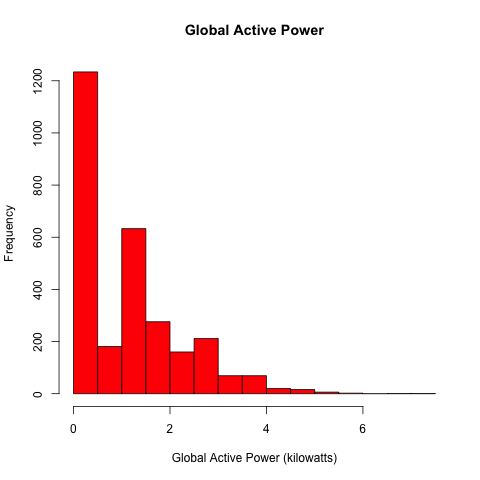
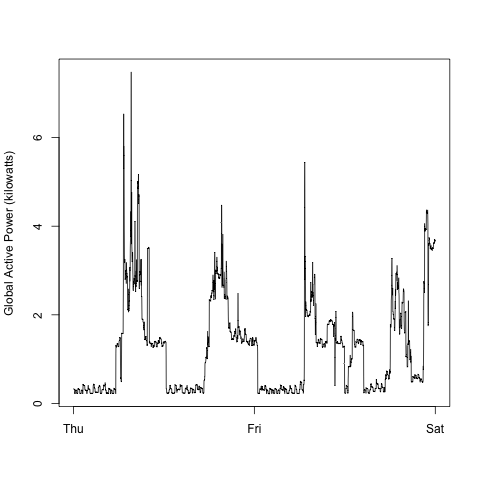
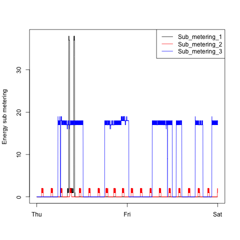
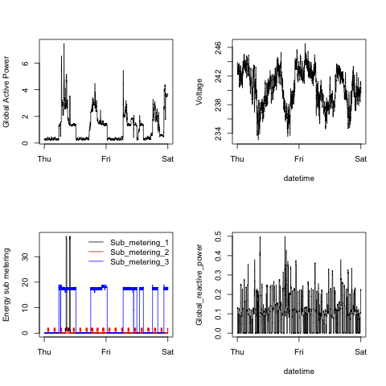

## Introduction

This repository is a submission for Project 1 of the "Exploratory Data Analysis" course offered via Coursera by John Hopkins University. 

A total of 4 PNG format images are supplied along with the necessary R code to recreate them fom the source data file. The period covered is Feb 1 - Feb 2, 2007.

This assignment uses data from
the <a href="http://archive.ics.uci.edu/ml/">UC Irvine Machine
Learning Repository</a>, a popular repository for machine learning
datasets. In particular, we will be using the "Individual household
electric power consumption Data Set" which I have made available on
the course web site:

* <b>Dataset</b>: <a href="https://d396qusza40orc.cloudfront.net/exdata%2Fdata%2Fhousehold_power_consumption.zip">Electric power consumption</a> [20Mb]

* <b>Description</b>: Measurements of electric power consumption in
one household with a one-minute sampling rate over a period of almost
4 years. Different electrical quantities and some sub-metering values
are available.

The following descriptions of the 9 variables in the dataset are taken
from
the <a href="https://archive.ics.uci.edu/ml/datasets/Individual+household+electric+power+consumption">UCI
web site</a>:

<ol>
<li><b>Date</b>: Date in format dd/mm/yyyy </li>
<li><b>Time</b>: time in format hh:mm:ss </li>
<li><b>Global_active_power</b>: household global minute-averaged active power (in kilowatt) </li>
<li><b>Global_reactive_power</b>: household global minute-averaged reactive power (in kilowatt) </li>
<li><b>Voltage</b>: minute-averaged voltage (in volt) </li>
<li><b>Global_intensity</b>: household global minute-averaged current intensity (in ampere) </li>
<li><b>Sub_metering_1</b>: energy sub-metering No. 1 (in watt-hour of active energy). It corresponds to the kitchen, containing mainly a dishwasher, an oven and a microwave (hot plates are not electric but gas powered). </li>
<li><b>Sub_metering_2</b>: energy sub-metering No. 2 (in watt-hour of active energy). It corresponds to the laundry room, containing a washing-machine, a tumble-drier, a refrigerator and a light. </li>
<li><b>Sub_metering_3</b>: energy sub-metering No. 3 (in watt-hour of active energy). It corresponds to an electric water-heater and an air-conditioner.</li>
</ol>

## Loading the data
Please download and extract the ZIP file into your working directory for R or RStudio. The supplied R code will read directly from the CSV file.

## Recreating the plots

To regenerate the plot, simply load the appropriate R file and call the named function as below. A PNG file will be created i your working directory.

| Plot | R File | Function |
|------|--------|----------|
| Plot 1| plot1.R | plot1() |
| Plot 2| plot2.R | plot2() |
| Plot 3| plot3.R | plot3() |
| Plot 4| plot4.R | plot4() |

The plots created by the code are shown below.

### Plot 1

 

### Plot 2

 

### Plot 3

 

### Plot 4

 

